# Настройка Контроллера Домена, Windows Server 2019

### Настройка сети NAT в VirtualBox v.7

1. Создать сеть 10.0.2.0/24, отключить DHCP, IPv6:

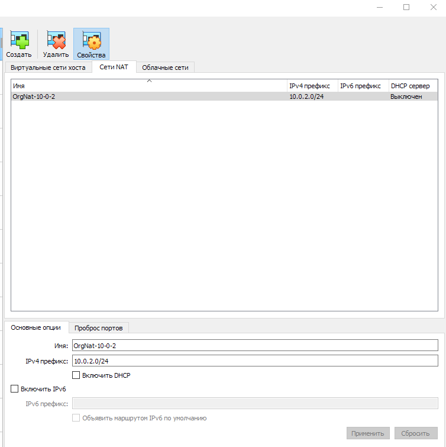
------
2. Подключить сетевой адаптер ВМ Windows Server к сети:

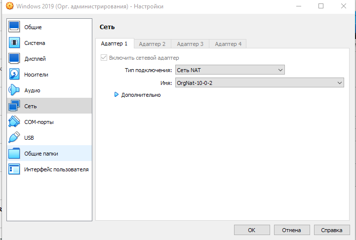
------

### Настройки Контроллера Домена

1. В настройках сетевого адаптера в Windows Server 2019 отключить IPv6, в свойствах IPv4 установить статический
IP 10.0.2.3, маску 255.255.255.0, шлюз 10.0.2.1, DNS 127.0.0.1

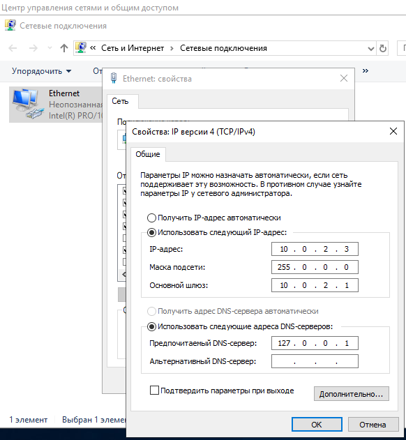
------
2. Сменить Имя компьютера: Этот компьютер > Свойства > Система > Изменить параметры > Изменить

3. В Диспетчере серверов добавить роли **Доменные службы Active Directory** ,  **DHCP-сервер** , **DNS-сервер**

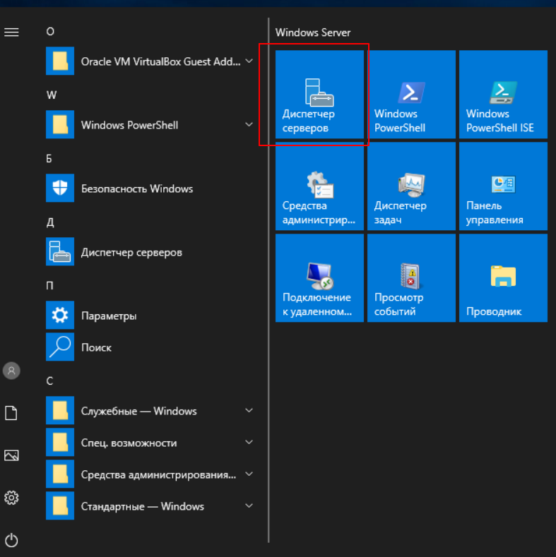
------
4. Повысить роль сервера до уровня контроллера домена:

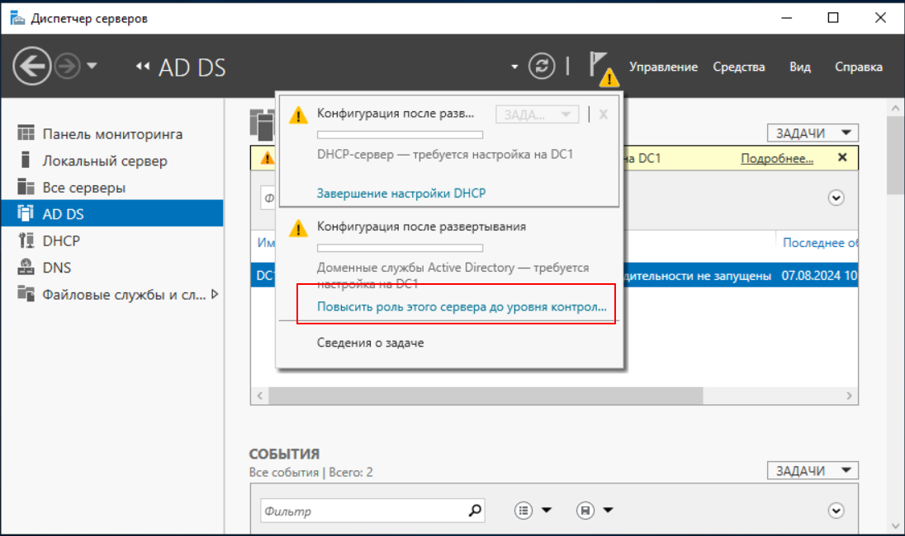
------
- указать имя корневого домена:

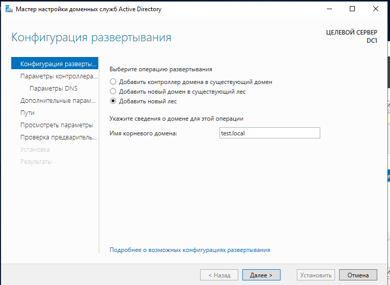
------
- установить пароль для режима восстановления служб каталога:

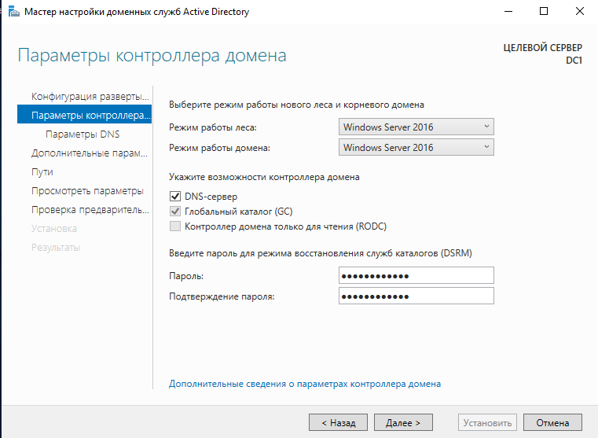
------
- параметры DNS оставить без изменения:

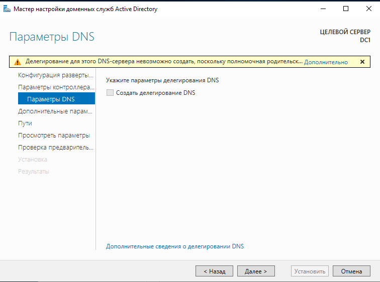
------
- имя домена NetBIOS оставить без изменения:


------
*После успешной проверки предварительных условий можно запустить настройку доменных служб Active Directory.*

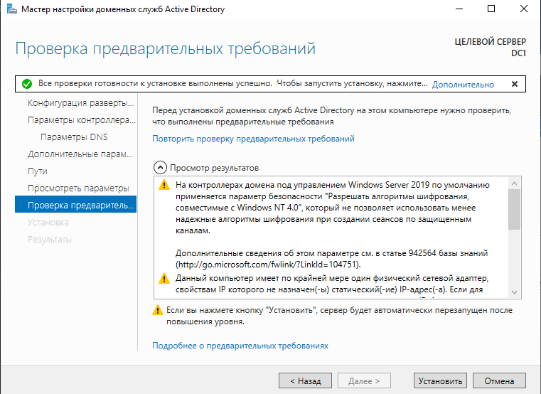
------
5. Настроить DHCP-сервер:

- Диспетчер серверов > Средства > DHCP

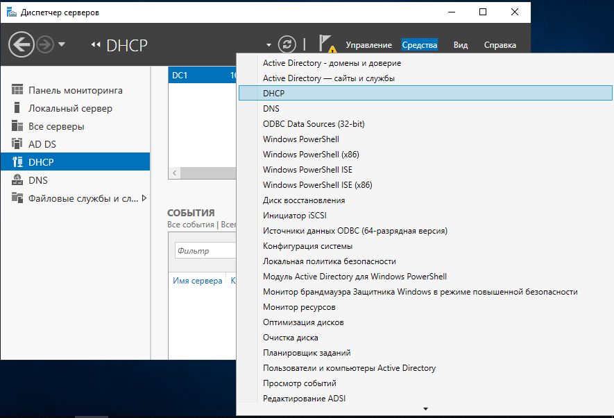
------
В оснастке DHCP  проверить и/или авторизовать сервер: DHCP > Список авторизованных серверов

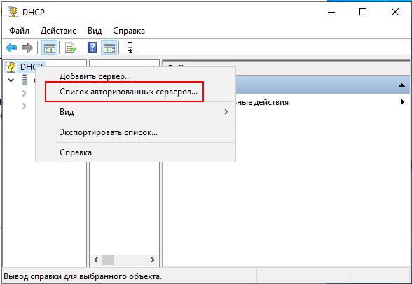
------
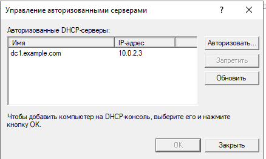
------
-  Проверить и/или установить привязки сервера:

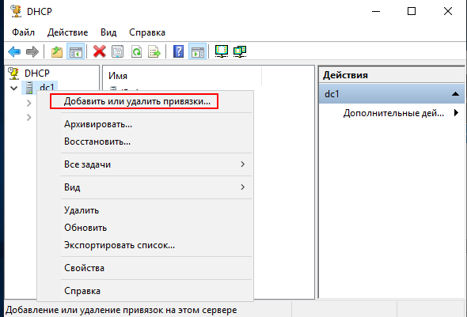
------
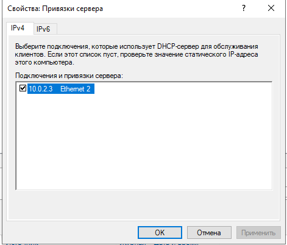
------
- Создать область с диапазоном ip-адресов:

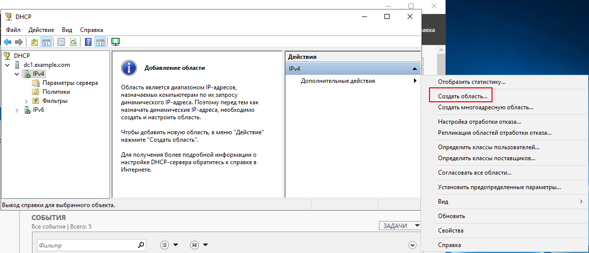
------
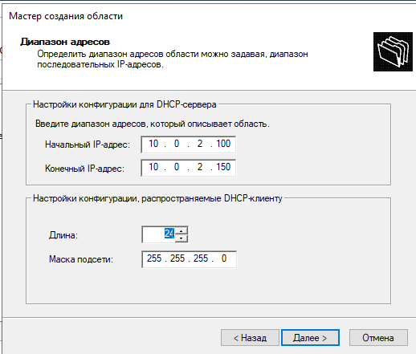
------
- Указать адрес DNS-сервера:

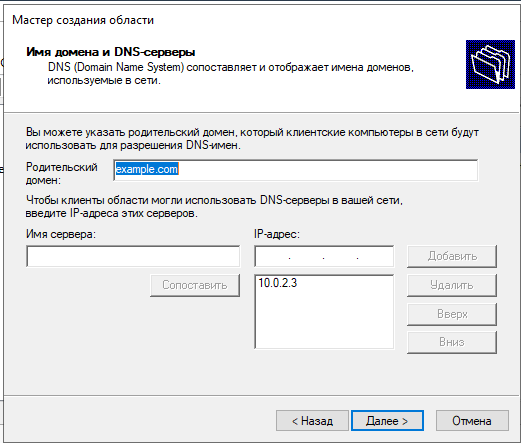
------
- Проверить пул адресов:

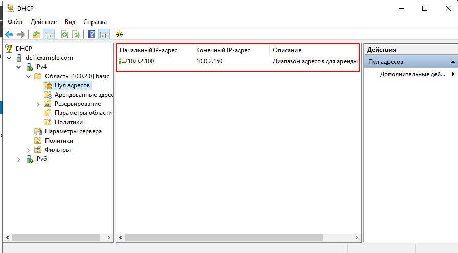
------
6. Настроить DNS-сервер:

Диспетчер серверов > Средства > DNS

- В каталоге **Серверы условной пересылки** создать сервер условной пересылки:

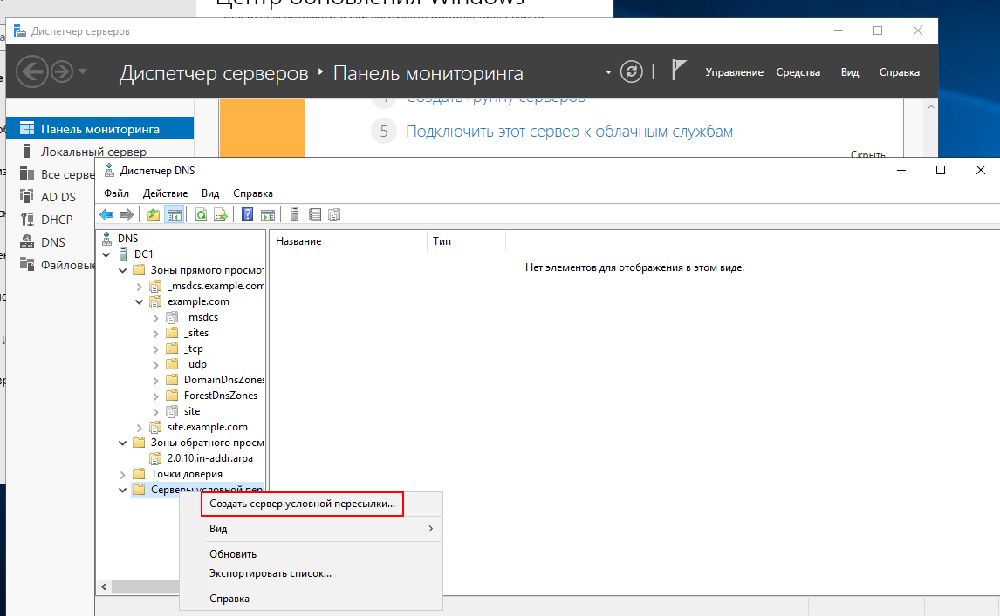
------
- В каталоге **Зоны обратного просмотра** создать зону обратного просмотра:

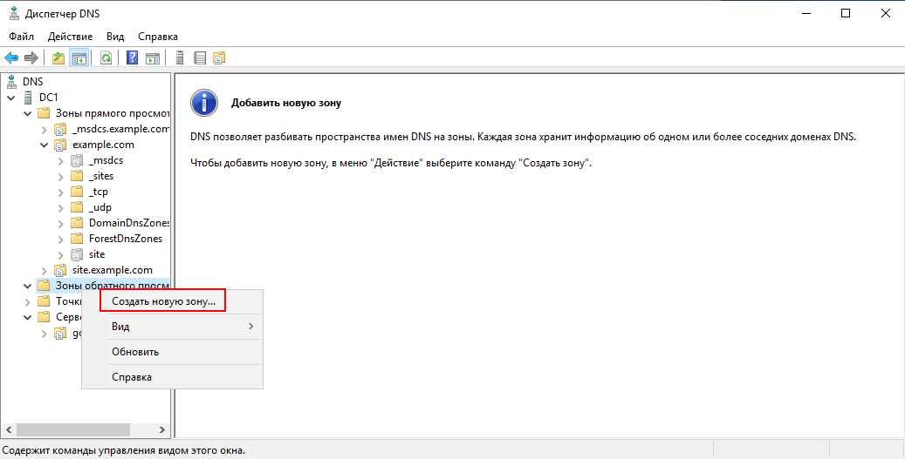
------
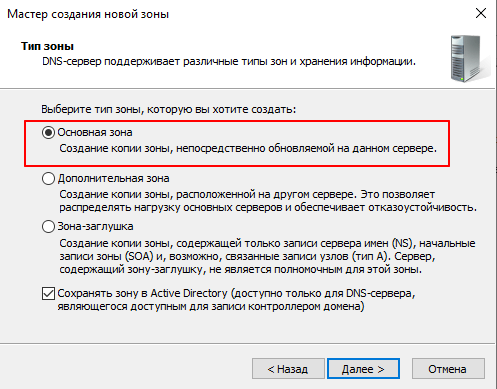
------
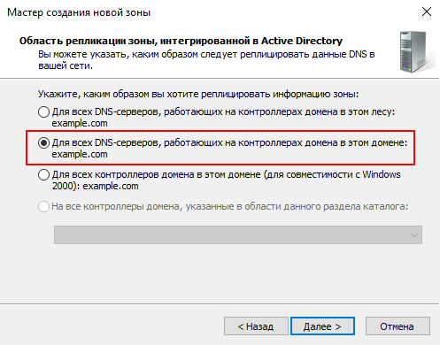
------
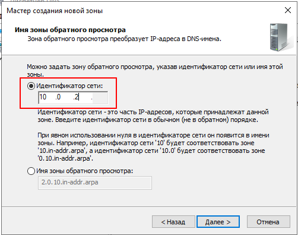
------
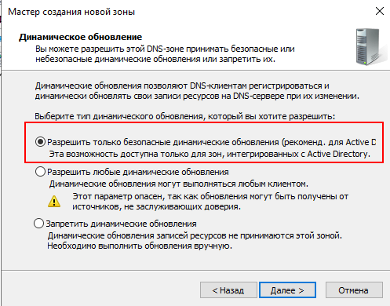
------
- В подкаталоге **site.example.com** каталога **Зоны прямого просмотра** создать узел(А) с ip 10.0.2.15

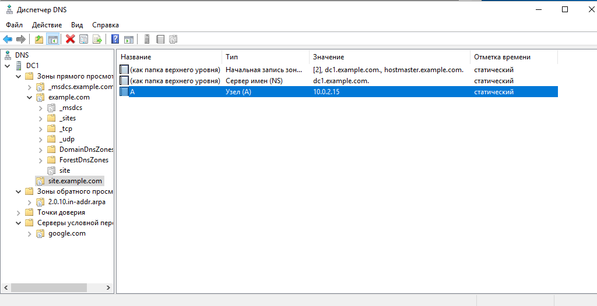
------
- В подкаталоге **example.com** каталога **Зоны прямого просмотра** создать узел(А) с ip 10.0.2.15

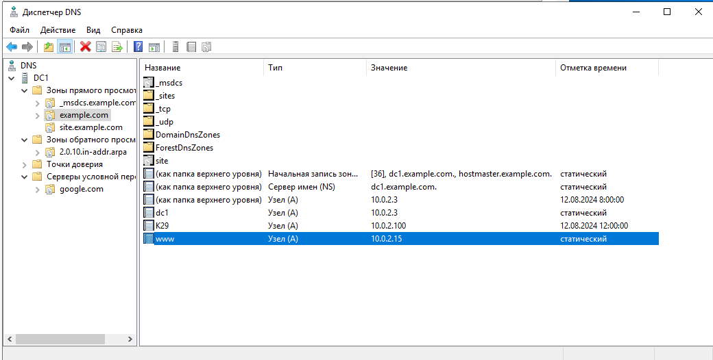
------
7. Создание пользователей и групп

Перейти в оснастку AD - пользователи и группы

* оснастку можно вызвать командой:
```
dsa.msc
```
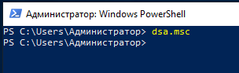
------
Создать группы и пользователей, включив их в группы:


------
8. Включение клиента в домен

Детали сетевого подключения на клиенте Windows 10:

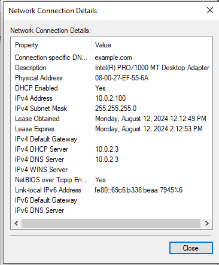
------
Получить отчет групповой политики:
```
gpresult /r
```


------
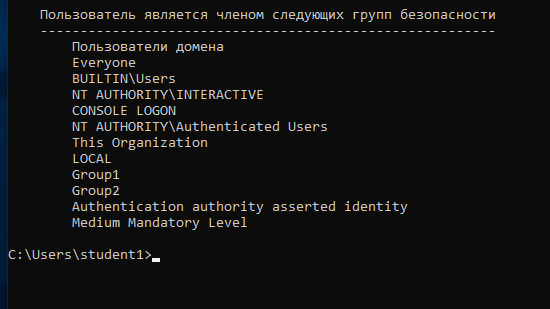
------
 


