# Настройка Контроллера Домена, Windows Server 2019

### Настройка сети NAT в VirtualBox v.7

1. Создать сеть 10.0.2.0/24, отключить DHCP, IPv6:


------
2. Подключить сетевой адаптер ВМ Windows Server к сети:


------

### Настройки Контроллера Домена

1. В настройках сетевого адаптера в Windows Server 2019 отключить IPv6, в свойствах IPv4 установить статический
IP 10.0.2.3, маску 255.255.255.0, шлюз 10.0.2.1, DNS 127.0.0.1


------
2. Сменить Имя компьютера: Этот компьютер > Свойства > Система > Изменить параметры > Изменить

3. В Диспетчере серверов добавить роли **Доменные службы Active Directory** ,  **DHCP-сервер** , **DNS-сервер**


------
4. Повысить роль сервера до уровня контроллера домена:


------
- указать имя корневого домена:


------
- установить пароль для режима восстановления служб каталога:


------
- параметры DNS оставить без изменения:


------
- имя домена NetBIOS оставить без изменения:

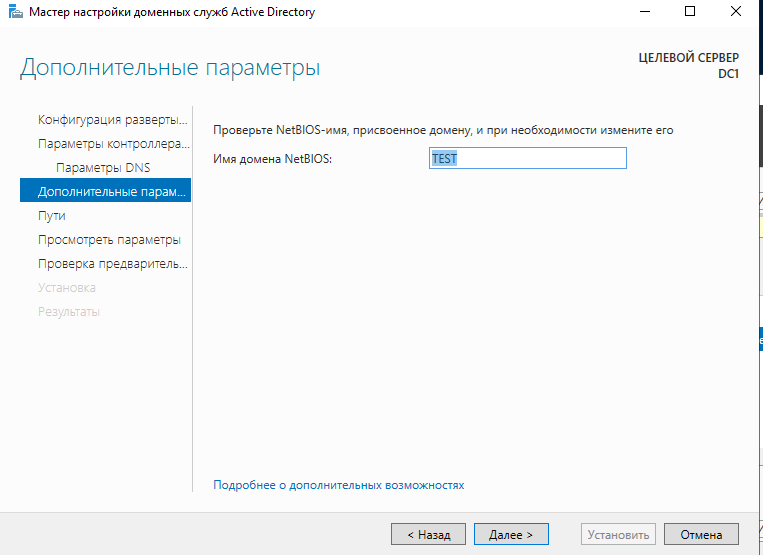
------
*После успешной проверки предварительных условий можно запустить настройку доменных служб Active Directory.*


------
5. Настроить DHCP-сервер:

- Диспетчер серверов > Средства > DHCP


------
В оснастке DHCP  проверить и/или авторизовать сервер: DHCP > Список авторизованных серверов


------

------
-  Проверить и/или установить привязки сервера:


------

------
- Создать область с диапазоном ip-адресов:


------

------
- Указать адрес DNS-сервера:


------
- Проверить пул адресов:


------
6. Настроить DNS-сервер:

Диспетчер серверов > Средства > DNS

- В каталоге **Серверы условной пересылки** создать сервер условной пересылки:


------
- В каталоге **Зоны обратного просмотра** создать зону обратного просмотра:


------

------

------

------

------
- В подкаталоге **site.example.com** каталога **Зоны прямого просмотра** создать узел(А) с ip 10.0.2.15


------
- В подкаталоге **example.com** каталога **Зоны прямого просмотра** создать узел(А) с ip 10.0.2.15


------
7. Создание пользователей и групп

Перейти в оснастку AD - пользователи и группы

* оснастку можно вызвать командой:
```
dsa.msc
```

------
Создать группы и пользователей, включив их в группы:


------
8. Включение клиента в домен

Детали сетевого подключения на клиенте Windows 10:


------
Получить отчет групповой политики:
```
gpresult /r
```


------

------
 
# Методические указания для варианта с сервером на Debian 11

1. Установка статического IP-адреса в Debian 11:

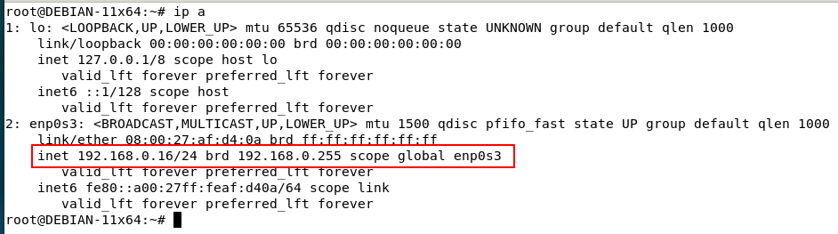
------
Для установки адреса отключить интерфейс и выполнить команду редактирования файла /etc/network/interfaces:
```
ifdown enp0s3
nano /etc/network/interfaces
```

Вместо "allow-hotplug enp0s3..." прописать:
```
auto enp0s3
iface enp0s3 inet static
 address 10.0.2.3/24
 gateway 10.0.2.1
```
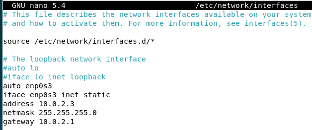
------
Для поднятия интерфейса и настройки разрешения имён выполнить:
```
ifup enp0s3
echo "nameserver 10.0.2.1" > /etc/resolv.conf
```
Протестировать выход в интернет:
```
ping ya.ru
```
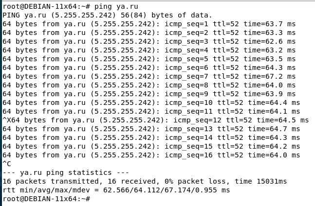
------
2. Установка имени сервера Debian 11:
```
echo dc1.example.com > /etc/hostname
hostname dc1.example.com
echo "10.0.2.3 dc1 dc1.example.com" >> /etc/hosts
```
Обновить систему и установить некоторые необходимые пакеты:
```
apt -y update && apt -y dist-upgrade
apt -y install net-tools man mc
```
3. Установка и настройка пакета samba4 для контроллера домена в Debian 11:
```
apt -y install samba winbind krb5-config krb5-user bind9-dnsutils bind9 isc-dhcp-server
```
При установке на вопрос об области по умолчанию для kerberos можно просто нажать ENTER.

Остановить службы samba 4:
```
systemctl stop smbd
systemctl disable smbd
systemctl stop nmbd
systemctl disable nmbd
systemctl stop winbind
systemctl disable winbind
```
Удалить (переименовать конфигурацию samba4) и развернуть домен:
```
mv /etc/samba/smb.conf /etc/samba/smb.conf.zap
samba-tool domain provision --use-rfc2307 --dns-backend=BIND9_DLZ --realm=EXAMPLE.COM --domain=EXAMPLE --adminpass=P@ssw0rd
```
4. Настройка DNS в Debian 11:

Отрадактировать конфигурацию DNS сервера Bind9:
```
nano /etc/bind/named.conf
```
В файл добавить строку:
```
include "/var/lib/samba/bind-dns/named.conf";
```
Отрадактировать конфигурацию DNS сервера Bind9:
```
nano /etc/bind/named.conf.options
```
В секцию options добавить tkey-gssapi-keytab:
```
options{
...
  tkey-gssapi-keytab "/var/lib/samba/bind-dns/dns.keytab";
};
```
Перезапустить и проверить сервис:
```
systemctl restart bind9
systemctl status bind9
```
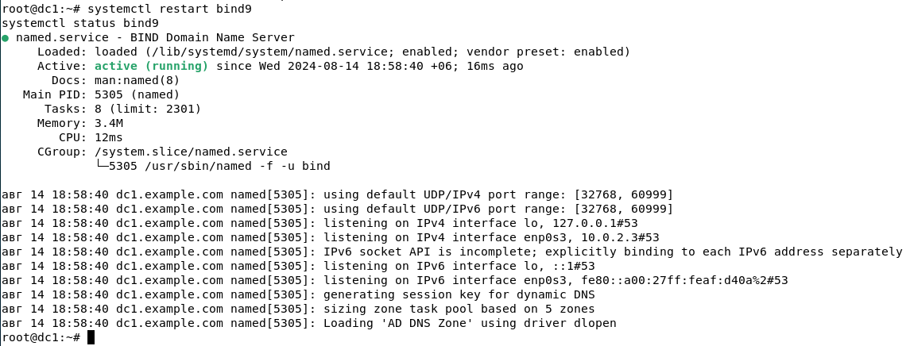
------
5. Настройка DHCP в Debian 11:

Отредактировать запуск сервера DHCP на интерфейсе enp0s3:
```
nano /etc/default/isc-dhcp-server
```
Прописать в файле:
```
INTERFACESv4="enp0s3"
```
Добавить в файл конфигурации DHCP:
```
nano /etc/dhcp/dhcpd.conf
```
следующие настроки по заданию:
```
subnet 10.0.2.0 netmask 255.255.255.0 {
 range 10.0.2.100 10.0.2.150;
 option routers 10.0.2.1;
 option domain-name "example.com";
 option domain-name-servers 10.0.2.3;
}
```
Перезапустить и проверить сервис DHCP:
```
systemctl restart isc-dhcp-server
systemctl status isc-dhcp-server
```
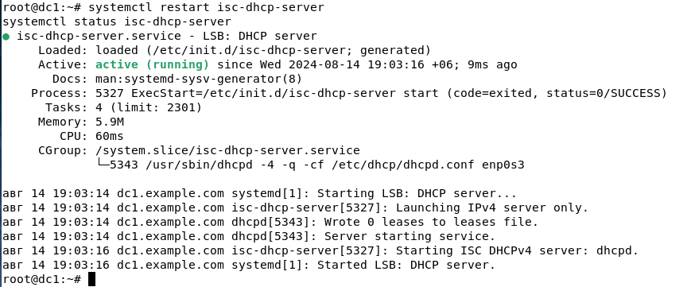
------
6.  Запуск контроллера домена на Debian 11:

Установить разрешение имён на локальный сервер:
```
echo -e "domain example.com\nsearch example.com\nnameserver 10.0.2.3" > /etc/resolv.conf
```
Запустить и проверить сервис домена:
```
systemctl unmask samba-ad-dc
systemctl enable samba-ad-dc
systemctl start samba-ad-dc
systemctl status samba-ad-dc
```
Настройка локальной сквозной авторизации Kerberos:
```
mv /etc/krb5.conf /etc/krb5.conf.zap
cp /var/lib/samba/private/krb5.conf /etc/krb5.conf
```
Проверить сквозную авторизацию, для этого набрать команду и пароль администратора P@ssw0rd:
```
kinit Administrator
```
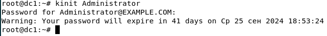
------
Команда:
```
klist
```
должна выдать информацию о полученном билете Kerberos:

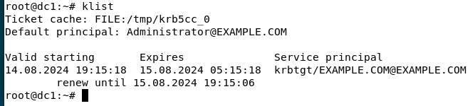
------

7. Редактирование DNS в Debian 11:
```
samba-tool dns add dc1 example.com www A 10.0.2.15
samba-tool dns add dc1 example.com sites A 10.0.2.15
samba-tool dns zonecreate dc1 2.0.10.in-addr.arpa
samba-tool dns add dc1 2.0.10.in-addr.arpa 3 PTR dc1.example.com
samba-tool dns add dc1 2.0.10.in-addr.arpa 15 PTR www.example.com
```
Проверить DNS командами:
```
host dc1
```
должна выдать:

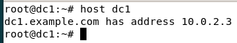
------
```
host 10.0.2.3
```
должна выдать:

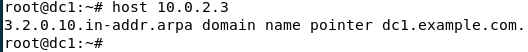
------
```
host www
```
должна выдать: www.example.com has address 10.0.2.15

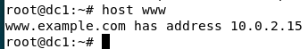
------
```
host yandex.ru
```
должна выдать ip адреса серверов yandex.ru

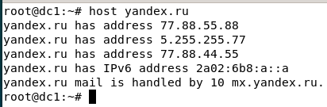
------
Просмотр всех записей DNS прямой зоны adm.org:
```
samba-tool dns query dc1 example.com @ ALL
```

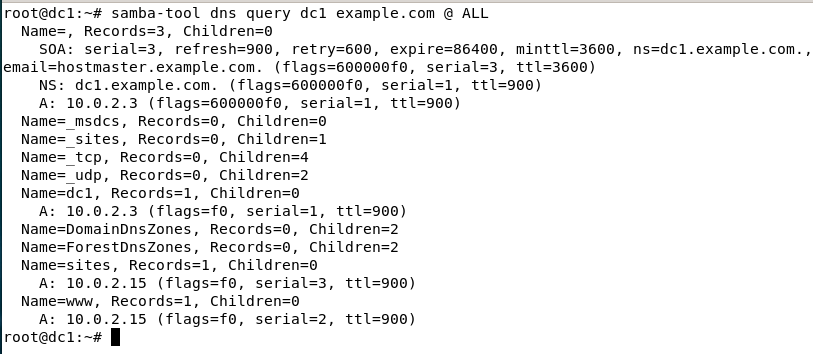
------
Просмотр всех записей DNS обратной зоны 2.0.10.in-addr.arpa
```
samba-tool dns query dc1 2.0.10.in-addr.arpa @ ALL
```

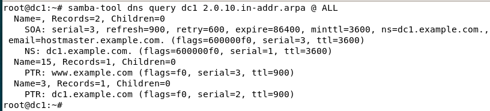
------
Проверить работу домена:
```
samba-tool domain info example.com
```

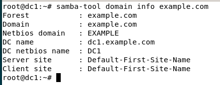
------
Протестировать список пользователей
```
wbinfo -u
```

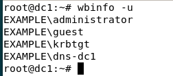
------
и групп
```
wbinfo -g
```

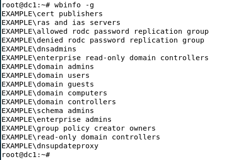
------
Протестировать получение списка компьютеров домена:
```
samba-tool computer list
```

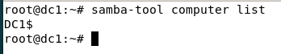
------
Посмотреть текущий уровень работы домена:
```
samba-tool domain level show
```

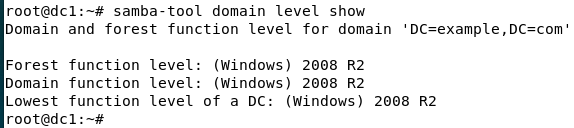
------
Поддерживаемые уровни работы домена samba4 можно посмотреть здесь: https://wiki.samba.org/index.php/Raising_the_Functional_Levels#Supported_Functional_Levels

8. Добавление организации, групп и пользователей в контроллер домена Debian 11:
```
samba-tool ou create "ou=ZTI,dc=example,dc=com"
samba-tool group add Group1 --groupou=ou=ZTI
samba-tool group add Group2 --groupou=ou=ZTI
samba-tool user create --userou=ou=ZTI student1 P@ssw0rd1
samba-tool user create --userou=ou=ZTI student2 P@ssw0rd2
samba-tool user create --userou=ou=ZTI student3 P@ssw0rd3
samba-tool group addmembers Group1 student1,student2
samba-tool group addmembers Group2 student3
```

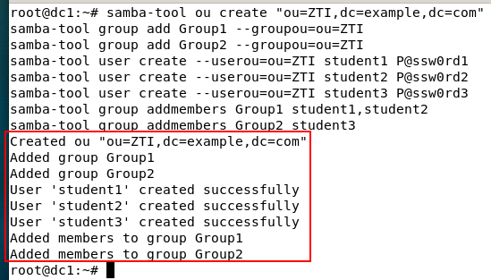
------
9. Создание групповой политики в Debian 11:
```
samba-tool gpo create ZTI -U Administrator --password=P@ssw0rd
```
Подключить групповую политику к ZTI по ранее созданному идентификатору (из вывода предыдущей команды):
```
samba-tool gpo setlink ou=ZTI,dc=example,dc=com -U Administrator --password=P@ssw0rd {C0EA2428-95D8-40FB-BD0E-78664B4E4B42}
```

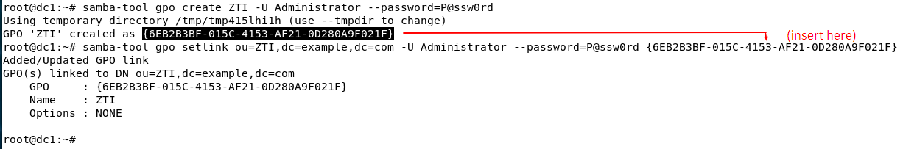
------
Протестировать созданную политику в списке групповых политик:
```
samba-tool gpo list student1
samba-tool gpo listall
```
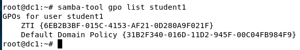
------
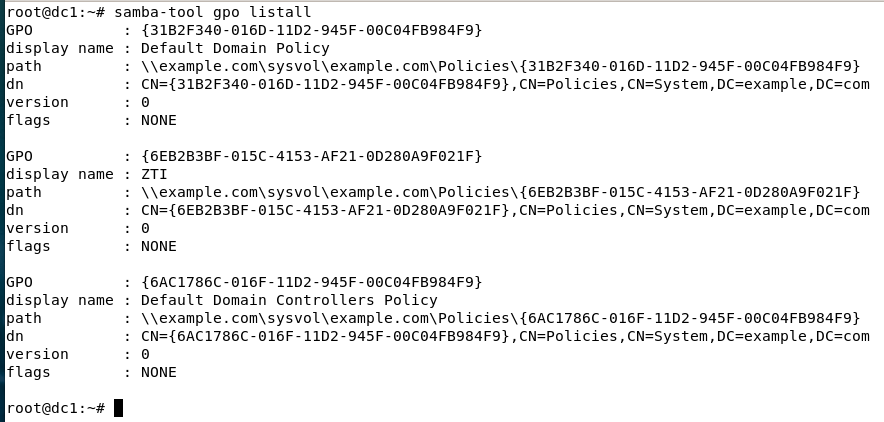
------
Далее после изменения GPO на Windows 10 могут сбиться права доступа, это можно продиагностировать и исправить такими командами:
```
samba-tool ntacl sysvolcheck
samba-tool ntacl sysvolreset
```
10. Ввод в домен Windows 10:

- Переименовать ПК. Перезагрузить.

- Проверить получение IP-адреса (Пуск→cmd→ipconfig) по DHCP с контроллера домена (адрес должен быть 10.0.2….).

Центр управления сетями и общим доступом → Подключение по локальной сети

- Ввести компьютер в домен example.com

Компьютер → Свойства → Изменить параметры

Проверить корректность создания учётной записи компьютера на контроллере домена DC1 в структуре Active Directory,
а также в прямой зоне DNS (обратная зона в samba 4 не заполняется автоматически).

11. Установка RSAT и редактирование GPO из Windows 10:

Для редактирования GPO необходимы утилиты RSAT, установим их на клиентский компьютер Windows 10.

Для этого необходимо войти в Windows 10 с учётными данными Administrator@example и паролем P@ssw0rd.

Для поиска команды установки RSAT можно запустить браузер Internet Explorer, открыть сайт samba.org, забить в поиске
RSAT и нажать на первую ссылку из поиска, в тексте найти указанную ниже строку установки и скопировать её в командную строку:

Выполнить → cmd (по правой кнопке мыши - от Администратора) → 
```
dism /online /add-capability /CapabilityName:Rsat.GroupPolicy.Management.Tools~~~~0.0.1.0 /CapabilityName:Rsat.Dns.Tools~~~~0.0.1.0 /CapabilityName:Rsat.ActiveDirectory.DS-LDS.Tools~~~~0.0.1.0
```

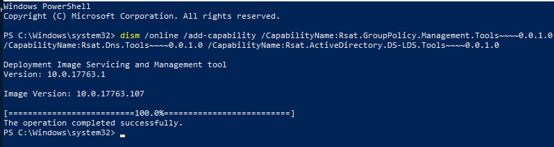
-----
В случае ошибок установки RSAT можно использовать виртуальную машину с предустановленными утилитами RSAT: 
```
https://disk.yandex.ru/d/h0zuRR2iR7XnPg
```
После установки в меню появляются средства управления доменом, необходимо запустить Group Policy, подключиться к серверу dc1,
найти в домене example.com организационную единицу ZTI и открыть групповую политику ZTI на редактирование.

В редакторе групповой политики перейти в User Configuration → Policies → Administrative Templates → Windows Components → Internet Explorer

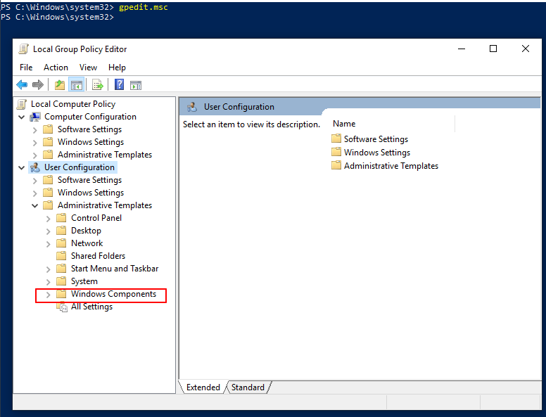
------
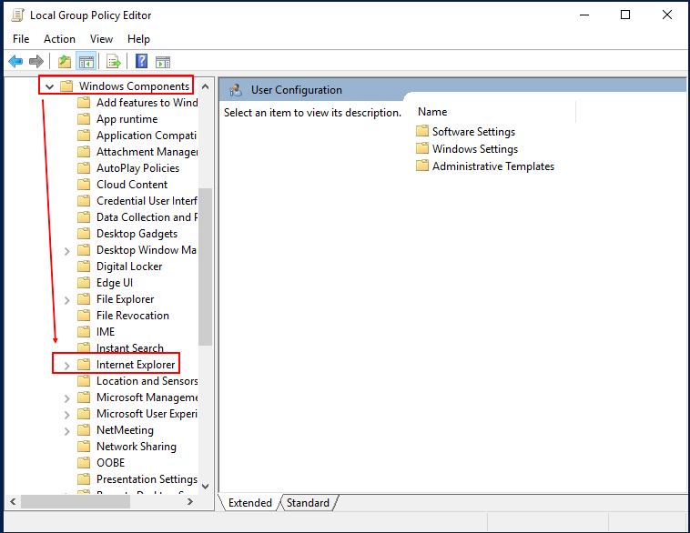
------
Установить начальную страницу:

Отредактировать Disable changing home page settings, установить Enabled и http://yandex.ru

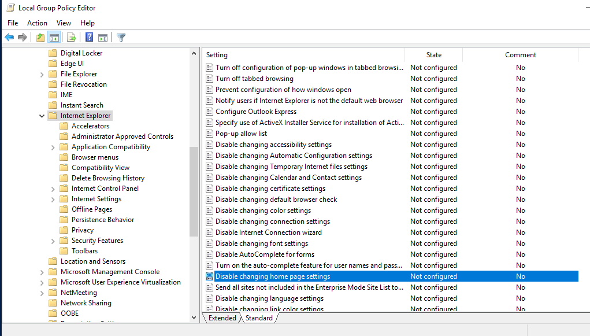
------
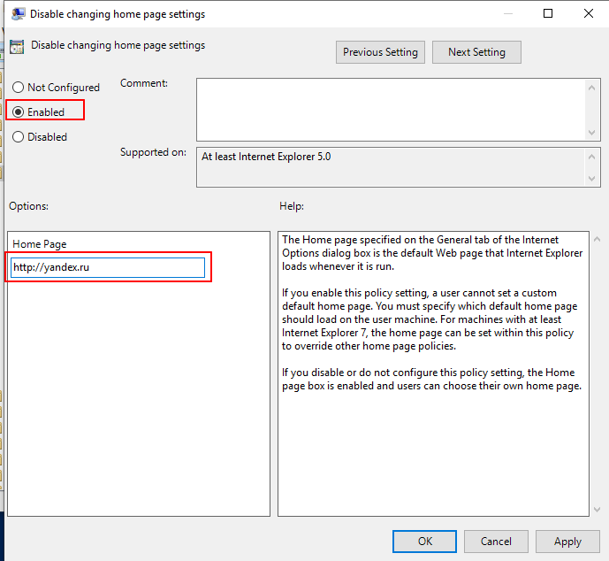
------
И заодно уберём надоедливый мастер настройки:

Отредактировать Prevent running First Run wizard, установить Enabled и Start page.

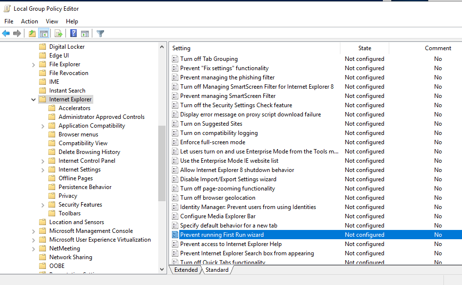
------
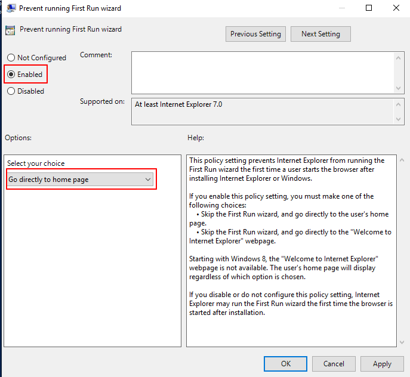
------

12. Проверка групповой политики на Windows 10:

Войти в Windows 10 с именем пользователя student1 и паролем P@ssw0rd1, затем:

Выполнить → cmd → 
```
gpresult /r
```
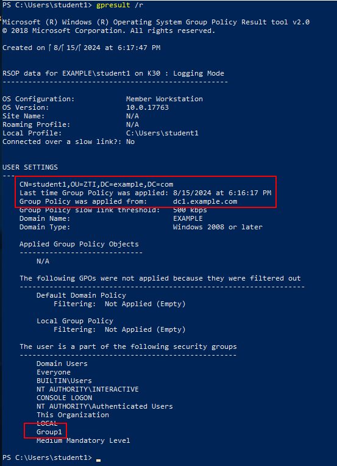
------
```
ipconfig /all
```
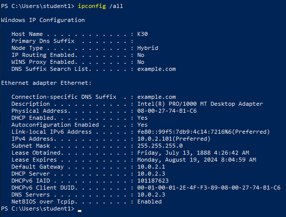
------
Запустить Internet Explorer. Должна отображаться страница yandex.ru.


